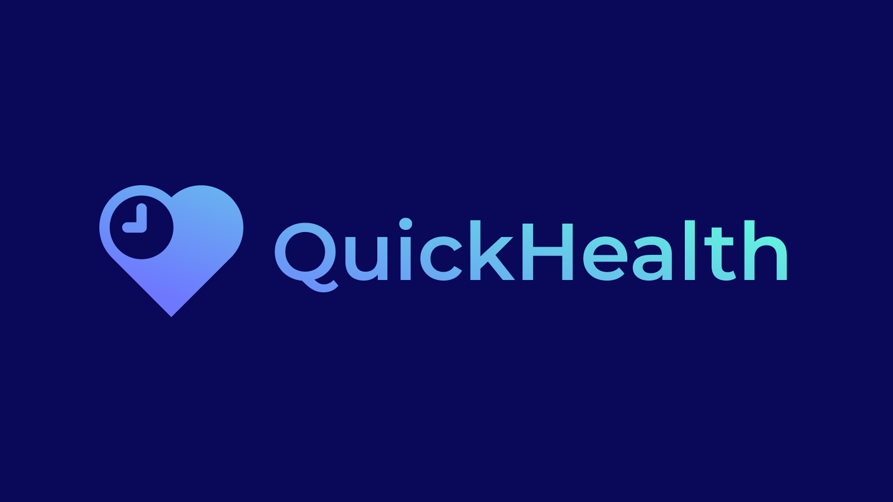

<p align="center">
    
</p>

QuickHealth is a lightweight macOS wellness CLI program that helps you to build healthier screen habits with customizable reminders and breaks. It reduces eye strain and improves productivity through features like Short Breaks, Long Breaks, Posture Reminders, and more, encouraging better rest, posture, and eye health. 

Learn more about QuickHealth [here.](https://github.com/Basical-ly/QuickHealth/wiki)
## Installation and Setup
1. Download Python [here](https://www.python.org/downloads/).
2. Enable 'Script Editor' notifications
    1. Open the 'Script Editor' Application (preinstalled in macOS) and copy and paste the code below into 'Script Editor'.
    ```
    display notification "Hello world!"
    ```
    3. Press ⌘ + S and select save.
    4. Click the gray play button in the top right of the window (it's between the square and hammer icon).
    5. A notification about 'Script Editor' notifications should appear; click on it and enable notifications from 'Script Editor'. Make sure notifications are set to 'Banners'.
3. Download and run the Python script, then QuickHealth will do the rest!

For more information on installing QuickHealth, [please read this.](https://github.com/Basical-ly/QuickHealth/wiki/Installing-QuickHealth)
## Features
### 20-20-20
QuickHealth will remind you to look 20 feet away from your device every 20 minutes for 20 seconds, following the 20-20-20 rule and improving your eye health.
### Posture
QuickHealth will gently remind you to correct your posture and avoid strain by reminding you at healthy intervals.
### Configurable
You can easily change break intervals and durations, allowing you to customize your experience exactly to your liking.
### Updates
QuickHealth is still being updated with new features, fixes, and improvements. QuickHealth also automatically checks for updates and notifies you if there is a new one available.
